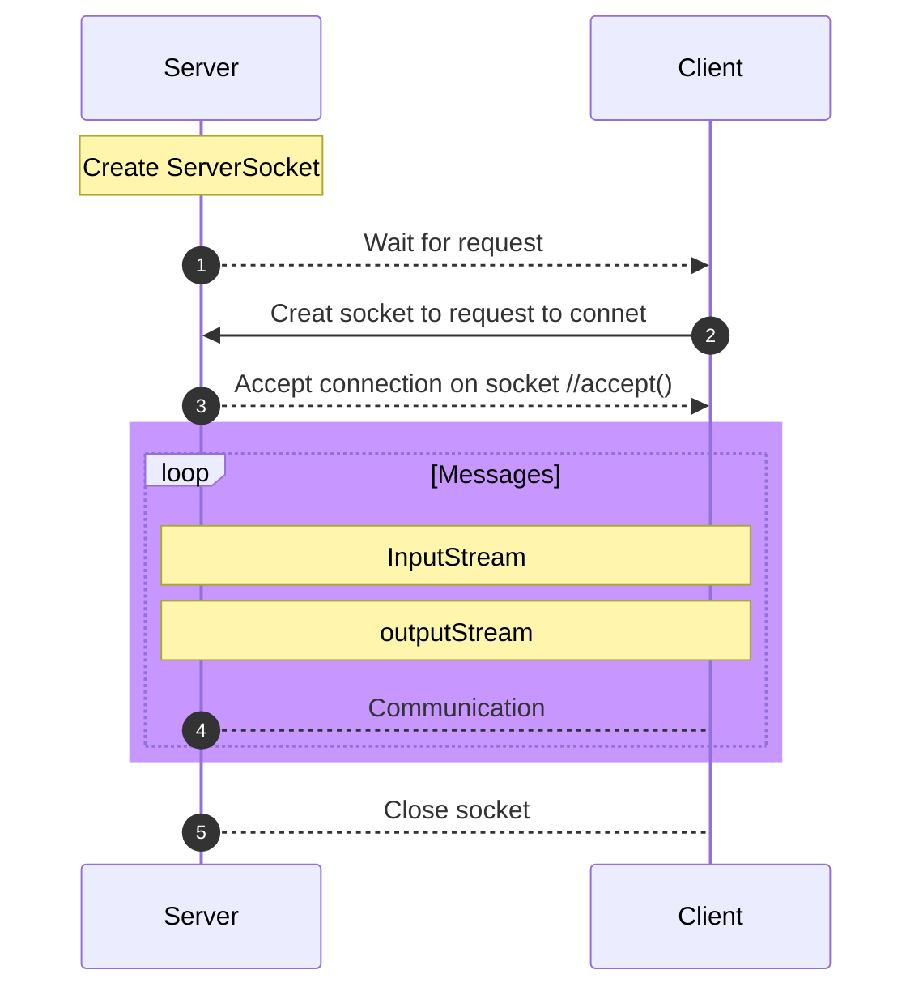

### Hi there 👋

### 👨🏻‍💻 &nbsp;About Me

🎓 &nbsp;I'm currently studying **Electrical and Computer Engineering** at **Duke University**.\
🌱 &nbsp;I'm on track of **Software Engineering** with a focus on **Full-Stack Development, System Engineering and Computer Networks**.\
💬 &nbsp;Feel free to reach out to me for suitable **Internship position**, or just for some interesting discussion.\
📫 &nbsp;How to reach me - [Wenxi Zhong@LinkedIn](https://www.linkedin.com/in/wenxi-zhong-909271227/) .\
✉️ &nbsp;You can also contact me at wenxizhong11@outlook.com!

### 🛠 &nbsp;Tech Stack

&nbsp;
&nbsp;
&nbsp;
&nbsp;
&nbsp;
&nbsp;
&nbsp;
&nbsp;
&nbsp;
&nbsp;
&nbsp;
&nbsp;

